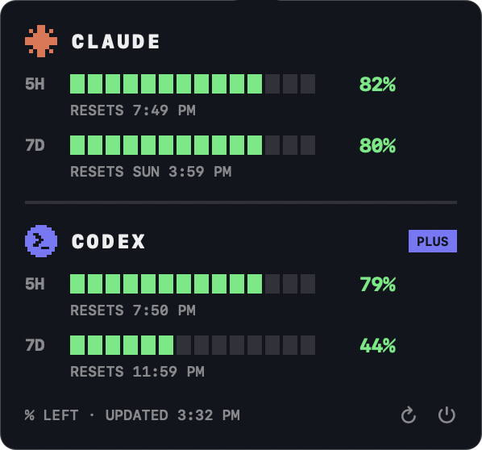

# Token Tracker

A tiny pixel-art macOS menu bar app that shows your Claude Code and Codex
(ChatGPT) rate-limit usage at a glance — no more opening each app to check.

```
menu bar:   ✳ 66%   ⬡ 95%         (% of the 5-hour window still LEFT)
```

<p align="center">
  
</p>

> **Unofficial tool** — not affiliated with or endorsed by Anthropic or OpenAI.
> It reads only your own usage data and relies on undocumented internals (see
> [Disclaimer](#disclaimer)), which may change without notice and break the
> app. Use at your own risk.

Everything is displayed as **remaining budget** — full bar = untouched window,
and it drains like an HP bar as you use tokens. Click the menu bar item for the
full picture: 5-hour and weekly bars for both services, with reset times, plan
badge, and color-coded severity (green → yellow ≤40% left → red ≤15% left).

Refresh cadence: Codex every ~15s (local file, free). Claude every 3 min while
Claude Code is actively in use (detected from local transcript writes), every
15 min when idle, with a 15-min backoff if Anthropic's endpoint rate-limits us
— sustained fast polling of that endpoint provably 429s. The ⟳ button always
forces a Claude fetch (at most once per minute).

## Where the data comes from

- **Claude** — reads the Claude Code OAuth token from the macOS Keychain
  (`Claude Code-credentials`, via `/usr/bin/security`) and queries
  `https://api.anthropic.com/api/oauth/usage` — the same endpoint Claude Code's
  `/usage` command uses. Nothing is stored; the token never leaves your machine
  except to Anthropic's own API.
- **Codex** — reads the newest session log under `~/.codex/sessions/`, which
  the Codex CLI/app writes locally. The last `token_count` event carries a
  `rate_limits` block with the 5-hour (`primary`) and weekly (`secondary`)
  windows. Purely local, no network call.

If the Claude token has expired (Claude Code refreshes it whenever you use it),
the popover shows "TOKEN EXPIRED — OPEN CLAUDE CODE". If a Codex window's reset
time has already passed, it shows 0% ("WINDOW RESET").

## Build & run

```sh
./make-app.sh          # swift build + assemble TokenTracker.app
open TokenTracker.app
```

Requires Xcode command line tools (Swift 5.9+). The app is menu-bar-only
(no Dock icon). Quit via the power button in the popover footer.

On the first refresh, macOS asks whether the app may read the
"Claude Code-credentials" Keychain item — choose **Always Allow** to avoid
repeat prompts. As noted above, the token is only ever sent to Anthropic's
own API.

## Start at login

System Settings → General → Login Items → "+" → select `TokenTracker.app`.

## Disclaimer

This project is not affiliated with, endorsed by, or supported by Anthropic
or OpenAI. It is read-only — it displays your own rate-limit data and never
sends anything anywhere except the one request to Anthropic's API described
above. It depends on undocumented internals on both sides:

- Claude Code's Keychain entry format and Anthropic's private
  `/api/oauth/usage` endpoint (the same one the `/usage` command calls).
- The Codex CLI's local session-log format under `~/.codex/sessions/`.

Any of these may change without notice and break the app. Use at your own
risk.

## Limitations

- macOS 13+ only, and build-from-source: the bundle is ad-hoc signed, not
  notarized, so there is no downloadable release.
- No OAuth token refresh. When the token expires the app shows
  "TOKEN EXPIRED — OPEN CLAUDE CODE" and recovers once Claude Code refreshes
  it.
- Codex data is only as fresh as the last logged `token_count` event — if you
  haven't used Codex recently, the numbers reflect that older session.

## License

[MIT](LICENSE)
