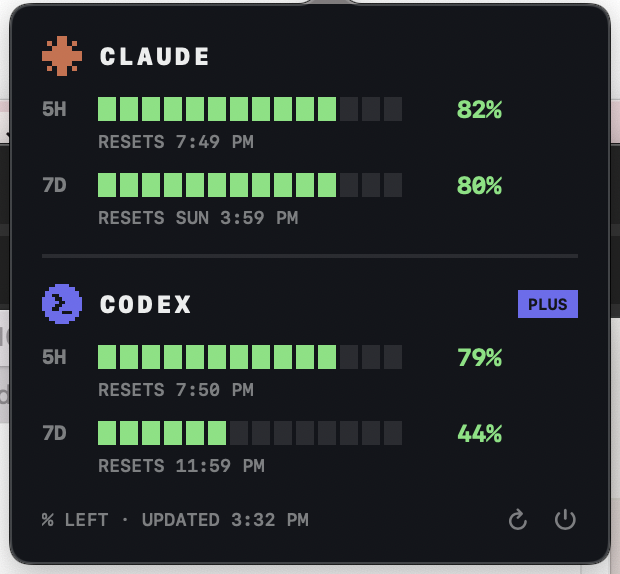

# Token Tracker

A tiny pixel-art macOS menu bar app that shows your Claude and Codex
(ChatGPT) rate-limit usage at a glance — no more opening each app to check.

```
menu bar:   ✳ 66%   ⬡ 95%         (% of the 5-hour window still LEFT)
```

<p align="center">
  
</p>

> **Unofficial tool** — not affiliated with or endorsed by Anthropic or OpenAI.
> It reads only your own usage data and relies on undocumented internals (see
> [Disclaimer](#disclaimer)), which may change without notice and break the
> app. Use at your own risk.

Everything is displayed as **remaining budget** — full bar = untouched window,
and it drains like an HP bar as you use tokens. Click the menu bar item for the
full picture: 5-hour and weekly bars for both services, with reset times, plan
badge, and color-coded severity (green → yellow ≤40% left → red ≤15% left).

Refresh cadence: local files are checked every ~15 seconds. Claude usage is
requested directly every **60 seconds while active**, or every **5 minutes
when idle**. Recent keyboard/mouse activity (idle-time metadata only) or Claude
Code transcript writes count as activity. Opening the menu or clicking ⟳
requests a fresh reading with a 15-second cooldown. Server `Retry-After` and
failure backoff always take precedence, including for manual refresh.

Claude shows `LIVE · AS OF …` for a successful API reading, or
`DESKTOP SNAPSHOT · AS OF …` for a local fallback. The footer's `CHECKED` time
means the tracker ran; it does not change the age of the displayed data.

To change the active interval (minimum 30 seconds), run and restart the tracker:

```sh
defaults write local.tokentracker ClaudePollSeconds -int 60
```

## Where the data comes from

- **Claude live usage** — reads only the encrypted `sessionKey` cookie for
  `claude.ai` from Claude Desktop's local cookie database, decrypts it using
  `Claude Safe Storage` in macOS Keychain, and requests
  `https://claude.ai/api/organizations/{orgId}/usage?skip_spend=1`. The initial
  `/api/organizations` request validates the organization against Desktop's
  latest history sample. Multiple organizations are never selected arbitrarily.
  Membership is rechecked when the session cookie or selected organization changes.
  Cookie values and the decryption key remain in memory; no secret is logged or
  written to disk. Requests disable redirects, disk caching, and shared cookies.
- **Claude Desktop fallback** — reads five-hour (`fh`) and weekly (`sd`) samples
  from `~/Library/Application Support/Claude/plan-usage-history.json`. Desktop's
  background interval is normally 15 minutes; recent usage-tray interaction can
  shorten it to 5 minutes. The file has a 4½-minute minimum write interval in the
  inspected app version. It has no reset timestamps.
- **Codex** — reads the newest session log under `~/.codex/sessions/`, which
  the Codex CLI/app writes locally. The last `token_count` event carries a
  `rate_limits` block with the 5-hour (`primary`) and weekly (`secondary`)
  windows. Purely local, no network call.

When a live request fails, the tracker retains the newest available reading,
its original timestamp, and an error note. It rereads the Desktop cookie on each
attempt to pick up login renewal. It never changes Claude's login or app files.
If a Codex window's reset time has passed, it shows 0% used (`WINDOW RESET`).

## Build & run

```sh
./make-app.sh          # swift build + assemble TokenTracker.app
open TokenTracker.app
```

Requires Xcode command line tools (Swift 5.9+). The app is menu-bar-only
(no Dock icon). Quit via the power button in the popover footer.

Click ⟳ to grant access to **Claude Safe Storage** when prompted by macOS.
Background checks never trigger Keychain prompts. The decryption key is reused
in memory for that run; a new build or changed Keychain permissions can require
another grant. Without access, local Desktop history remains available.

Validation:

```sh
swift test
.build/debug/TokenTracker --check-claude --allow-keychain-prompt
# Two real reads 60 seconds apart; prints only percentages and status:
.build/debug/TokenTracker --check-claude --allow-keychain-prompt --repeat
```

## Start at login

System Settings → General → Login Items → "+" → select `TokenTracker.app`.

## Disclaimer

This project is not affiliated with, endorsed by, or supported by Anthropic
or OpenAI. It is read-only — it displays your own rate-limit data and never
sends requests only to Claude's own usage and organization endpoints described
above. It depends on undocumented internals on both sides:

- Claude Desktop's local history and Chromium cookie formats, its Safe Storage
  Keychain item, and Claude's private organization/usage endpoints.
- The Codex CLI's local session-log format under `~/.codex/sessions/`.

Any of these may change without notice and break the app. Use at your own
risk.

## Limitations

- macOS 13+ only, and build-from-source: the bundle is ad-hoc signed, not
  notarized, so there is no downloadable release.
- The web endpoint can rate-limit requests or present a Cloudflare challenge.
  The tracker backs off and labels retained data; one successful probe does not
  guarantee future availability.
- A Desktop-history fallback may lag by 15 minutes or more. Signing out of
  Claude removes live access until you sign in again.
- Codex data is only as fresh as the last logged `token_count` event — if you
  haven't used Codex recently, the numbers reflect that older session.

## License

[MIT](LICENSE)
